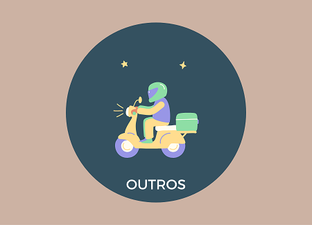

# Repositório mangabeiras

Catálogo de produtos e serviços disponíveis na comunidade da Av. Mangabeiras, Barra dos Coqueiros - SE.
Tem por objetivo aplicar e aprimorar os conhecimentos de HTML/CSS/Bootstrap e git.
A proposta é desenvolver uma webpage interativa com o contato das pessoas, com link direto para o WhatsApp, facilitando assim, a comunicação entre o usuário e o anunciante.

## Lista de tarefas

### Template Bootstrap
 - [x] Pesquisa
 - [x] Adaptação e edição
 - [x] Alimentar os dados
---
### Github Page
  - [x] Publicação

#### Pesquisar sobre Django para desenvolvimento web